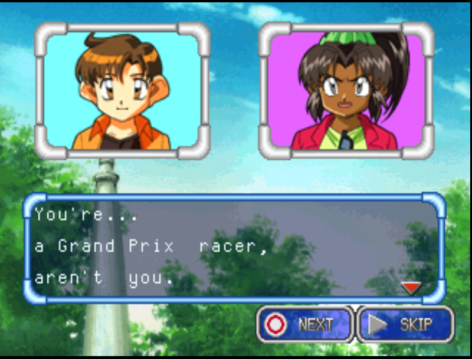
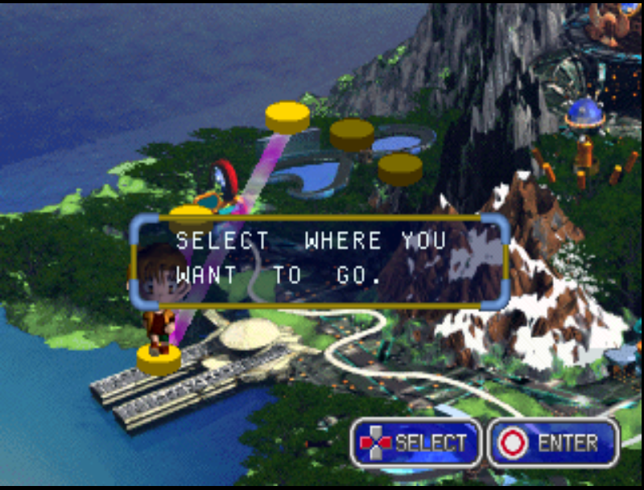
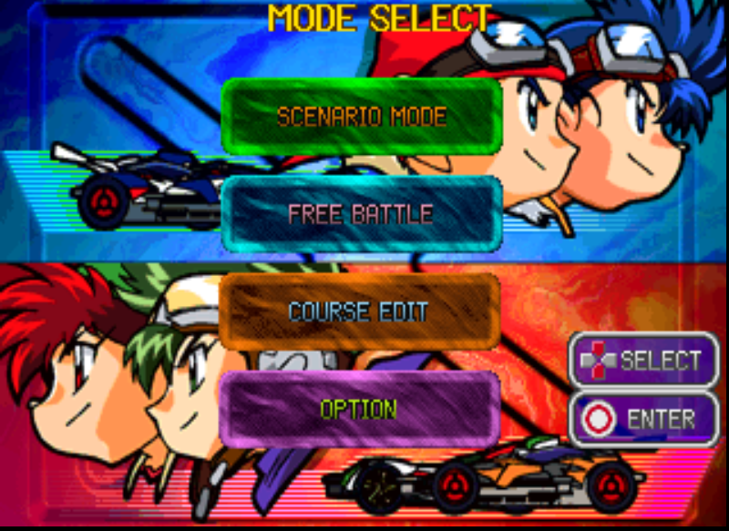

# 🏎️💨 Bakusou Kyoudai Let's & Go!! Eternal Wings — English Patch!

Ever wanted to play the 1998 Mini 4WD racing RPG **Bakusou Kyoudai Let's & Go!! Eternal Wings** (爆走兄弟レッツ＆ゴー！！ エターナルウィングス) by Jaleco, and actually understand what everyone's saying? Now you can! 🎉

The story, the menus and the on-screen text are all in English. 🇬🇧 (The voice acting and videos are still in Japanese.)

| | |
|---|---|
| 🎮 **Platform** | Sony PlayStation (PS1) |
| 💿 **Serial** | SLPS-01489 (Japan) |
| 🩹 **Patch format** | xdelta3, applied to Track 1 only |
| 🧪 **Tested on** | DuckStation |
| ⬇️ **Download** | grab it from [**Releases**](../../releases) |

---

## 📸 Screenshots

| 💬 Story dialogue | 🗺️ World map | 📋 Mode select |
|:---:|:---:|:---:|
|  |  |  |

*Taken from the patched disc in DuckStation.*

---

## ✅ What's translated

- 📖 **The whole story script**: about 157,000 characters of dialogue across 5,202 messages
- 📋 **All the menus**: mode select, options, Free Battle, Course Edit, character and machine select
- ⌨️ **Name entry**: keyboard, prompts and confirmation boxes
- 💾 **Memory card messages** (`LOAD YOUR GAME DATA?` …)
- 🏷️ **Speaker name plates** in conversations
- 🔧 **The Workshop**: part names and descriptions
- 🚗 **Machine names and spec sheets**
- 🗺️ **The world map**: prompts and location plates
- 🏁 **Race graphics**: results and the finish banner (`FINISH!`)
- 🎨 **Title and menu artwork**: 125 Japanese images redrawn in English

### 🇯🇵 Still in Japanese

- 🎙️ The voice acting 
- 🎬 The FMV videos
- 🤏 A few small leftovers, like the Course Edit banner and the default names on the ranking board

---

## 📦 What you need

The **Redump** dump of the Japanese disc. It comes as two `.bin` files plus a `.cue`:

| File | Size (bytes) | CRC32 | MD5 |
|---|---|---|---|
| `(Track 1).bin` | 474,381,936 | `d2fcc640` | `3fc049b468b882cfabbea547be02b18f` |
| `(Track 2).bin` | 36,060,864 | `81b6b6e5` | `311e8d2e2f31f2cf37329f558b86ec93` |

SHA-1 of Track 1: `cb8b80dc39ca3336590a15e54e2629cc892b8cc9`

👉 **Only Track 1 gets patched.** Leave Track 2 (the CD-audio track) and the `.cue` exactly as they are.

> ⚠️ This repo contains **only a patch file**. No game data is included, so you need your own copy of the game.

---

## 🛠️ How to apply

1. 💾 **Back up** your `(Track 1).bin` first!
2. 🩹 Apply `Bakusou Kyoudai Let's & Go!! Eternal Wings - English (Track 1).xdelta` to `(Track 1).bin` with any xdelta3 tool:
   - 🪟 **Windows app:** [Delta Patcher](https://github.com/marco-calautti/DeltaPatcher) or xdeltaUI
   - 🌐 **In your browser:** [Rom Patcher JS](https://www.marcrobledo.com/RomPatcher.js/)
   - 💻 **Command line:**
     ```
     xdelta3 -d -s "original (Track 1).bin" "Bakusou Kyoudai Let's & Go!! Eternal Wings - English (Track 1).xdelta" "patched (Track 1).bin"
     ```
3. 📝 Give the patched file **the same name as your original Track 1** (the name the `.cue` points to), and keep it in the same folder as Track 2 and the `.cue`.


### 🔍 Check your result

| File | Size (bytes) | CRC32 | MD5 |
|---|---|---|---|
| Patched `(Track 1).bin` | 474,417,216 | `a14d7add` | `1fb548e378c10e62b664dfe2b6751201` |
| Patch file (`.xdelta`) | 4,036,332 | `dd628a63` | `7d254a96ed32211ffd78c5151cce8a38` |

SHA-1 of the patched Track 1: `96bf276c9a3e86f1edde93be2c9dd4b4fb8b9b16`

📏 The patched Track 1 is **35,280 bytes (15 sectors) bigger** than the original. That's expected, don't worry!

❌ If the patcher complains about a checksum or source mismatch, your Track 1 isn't the Redump dump listed above.

---

## 🤓 Technical notes

- 🔠 The game draws Japanese text with 16×16 glyph atlases that are built per scene. The English text packs **two 8×16 letters into each 16×16 cell**, so it fits the original text boxes **without touching the game engine at all**.
- 🧰 Everything was rebuilt with custom tools: LZSS container repacking, pointer relocation for the scene scripts, and TIM image injection. A rebuild with no changes reproduces the original data track byte for byte, and the final disc passes every regression check. ✔️
- 🖥️ Tested on emulator (DuckStation). It hasn't been tried on real PlayStation hardware yet.

---

## ⚖️ Disclaimer

This is an unofficial, non-commercial fan project ❤️. It is not affiliated with or endorsed by Jaleco, Tamiya, Shogakukan, TV Tokyo or the original author, Tetsuhiro Koshita. *Bakusou Kyoudai Let's & Go!!* and all related characters and marks belong to their respective owners. Please support the official releases! 🙏

🤖 **AI assistance:** AI tools helped with parts of this project.
